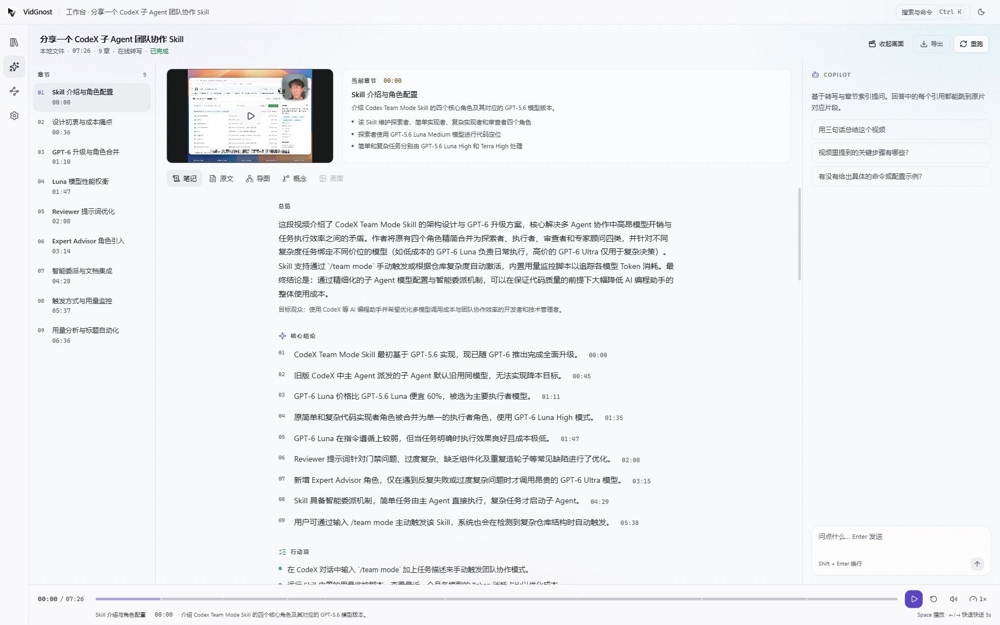
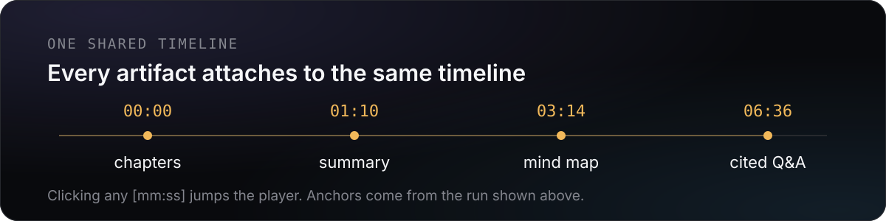
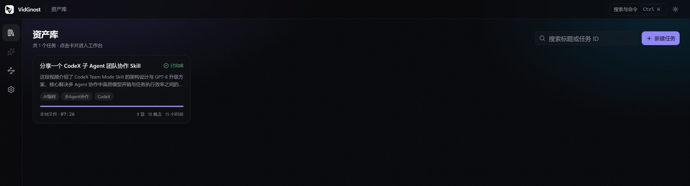
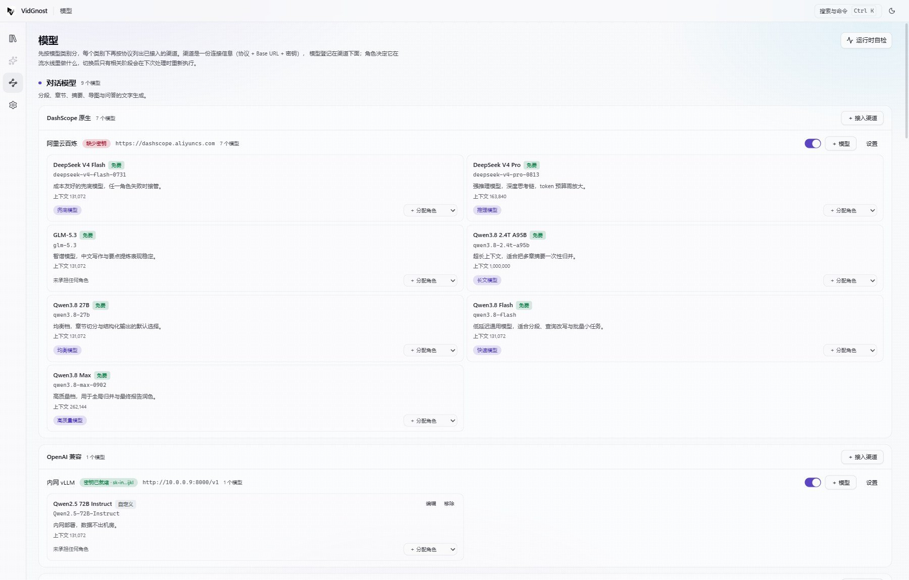

<div align="center">
  

  <h1>VidGnost</h1>

  <p><strong>A video knowledge engine.</strong><br />
  Turn a video or audio file into one timestamped timeline. Chapters, summary, mind map, concepts and
  cited answers all attach to it, and every <code>[mm:ss]</code> jumps back to the source.</p>

  <p><a href="./README.md">English</a> | <a href="./README.zh-CN.md">中文</a></p>

  <p>
    
    
    
    
    
    <a href="./LICENSE"></a>
  </p>
</div>

## What a run looks like

<p align="center">
  
</p>

<p align="center"><sub>Taken from a real run in this repository: a 7:26 video that produced 9 chapters and
10 concepts. The left rail lists the chapters, every conclusion in the middle carries a clickable timecode,
and the Copilot panel on the right names the clip each answer came from.</sub></p>

## How it differs from transcription tools

Transcription tools return one long block of text. Summarisation tools return conclusions you cannot verify.
VidGnost builds the timestamped structure first, then attaches every artefact to it.

<p align="center">
  
</p>

1. **Every claim points back to the source.** Summary highlights, transcript lines, mind map nodes,
   concepts and answers share one `seek` implementation: clicking a timecode jumps the player.
2. **Online models first, local models as fallback.** Alibaba Cloud Model Studio (DashScope) powers chat,
   vision, embeddings, translation and file-level ASR by default; missing credentials or network failures
   fall back to the local `faster-whisper`.
3. **Artefacts carry the structure.** Chapters are the structural unit, retrieval chunks are bound to
   chapters, and the index covers raw text, contextual prefixes and generated question variants.

## Get started

Requirements: Node.js 18+, `pnpm`, and `ffmpeg`/`ffprobe` on `PATH`.
Downloading online videos also needs `yt-dlp`; local Whisper needs Python 3.10+ and `uv`.

```bash
pnpm install

# terminal 1 — backend
pnpm dev:backend

# terminal 2 — the Electron desktop window
pnpm dev:desktop
```

To work on the renderer alone, without the Electron shell:

```bash
pnpm dev:frontend        # http://127.0.0.1:6221
```

Then drag a local file into the library, or paste a link.

## How it works

Ten ordered stages, each writing a checkpoint, so an interrupted run continues from the last checkpoint
instead of starting over:

| # | Stage | Output |
| --- | --- | --- |
| 1 | `ingest` | media on disk, duration and content fingerprint |
| 2 | `audio` | 16 kHz mono audio and ASR chunks |
| 3 | `transcribe` | sentence/word timestamps, SRT, plain text |
| 4 | `structure` | semantic paragraphs, chapters with bullets and anchors |
| 5 | `insight` | TL;DR, highlights, actions, questions, glossary, tags |
| 6 | `mindmap` | mind map tree plus Mermaid source |
| 7 | `knowledge` | lightweight concept/relation graph |
| 8 | `vision` | key frames, on-screen text, multimodal captions |
| 9 | `index` | contextual prefixes, question variants, vector + BM25 index |
| 10 | `finalize` | Markdown report, JSON pack, translation artefacts |

The stage cache key is `sha1(stage | source fingerprint | relevant model routes | relevant options)`,
so **changing a model only re-runs the stages it affects**.

### Retrieval and Q&A

1. Chunking respects chapter boundaries (target 320 tokens, 80-token overlap).
2. Each chunk gets a 50–80 token contextual prefix and three question variants, which handle pronoun
   drop-out and colloquial phrasing.
3. Vector top-40 and BM25 top-40 recall in parallel, fused with RRF (k=60).
4. OpenRouter reranks the top 30; the best K (default 8) become evidence.
5. Global questions such as "what is this about overall?" are handled by chapter-summary map-reduce
   instead of fragment top-k.
6. Answers stream token by token; the server validates `[mm:ss]` anchors and maps them onto structured
   citations.

## Models and credentials

The pipeline depends on roles, never on concrete model names. The 15 built-in models work out of the box,
and you can attach your own channels by protocol (OpenAI-compatible, Anthropic Messages, Google Gemini,
native DashScope, OpenRouter, local runtime). A registered model is treated like any built-in one: it joins
the catalogue, can take a role, and participates in the stage cache key.

| Role | Default model | Provider |
| --- | --- | --- |
| `llm.fast` | `qwen3.8-flash` | DashScope |
| `llm.balanced` | `qwen3.8-27b` | DashScope |
| `llm.reasoning` | `deepseek-v4-pro-0813` | DashScope |
| `llm.quality` | `qwen3.8-max-0902` | DashScope |
| `llm.bulk` | `qwen3.8-2.4t-a95b` | DashScope |
| `llm.fallback` | `deepseek-v4-flash-0731` | DashScope |
| `vision.primary` | `qwen3.8-omni-flash` | DashScope |
| `asr.online` | `qwen-audio-3.1-asr-flash-filetrans` | DashScope |
| `asr.local` | `faster-whisper` | local |
| `embedding` | `qwen3.7-text-embedding-flash` | DashScope |
| `rerank` | `nvidia/llama-nemotron-rerank-vl-1b-v2:free` | OpenRouter |
| `translate` | `qwen-mt-uni` | DashScope |

Credentials come from environment variables; the Models workspace also accepts inline overrides and
shows only a masked tail:

```bash
DASHSCOPE_API_KEY=sk-xxxxxxxx      # Alibaba Cloud Model Studio
OPENROUTER_API_KEY=sk-or-v1-xxxx   # OpenRouter (rerank)
```

## Workbench

Four workspaces sharing one time coordinate system.

<p align="center">
  
</p>

- **Library** — the single entry point: readiness, tags, scale, search and delete.
- **Studio** — chapter rail, content stage and Copilot, with a persistent player bar. Five tabs (notes,
  transcript, mind map, concepts, frames) plus a live stage board while processing.
- **Models** — organised by model category first (chat, vision, embedding, rerank, transcription,
  translation), then by protocol, then by the channels you connected; a channel holds its own base URL and
  credential, and roles are assigned on the model cards.
- **Settings** — default processing options, storage directory and toolchain probing.

<p align="center">
  
</p>

The interface is dark-first: a graphite canvas with an aurora wash, hairline borders, an 8pt grid,
monospaced timecodes, and a global `Ctrl/⌘ + K` command palette. The light theme uses the same semantic
tokens and passes the same contrast bar (`node scripts/check-theme-contrast.mjs`).

## Repository layout

```text
VidGnost/
├─ apps/
│  ├─ api/                    # Fastify + TypeScript backend
│  │  ├─ python/              # isolated faster-whisper Python worker
│  │  ├─ src/core/            # config, errors, fs, text, process
│  │  ├─ src/providers/       # model catalogue, role routing, provider clients, health checks
│  │  ├─ src/media/           # source resolution, audio extraction, key frames, perceptual hashing
│  │  ├─ src/asr/             # online/local transcription orchestration and normalisation
│  │  ├─ src/insight/         # segmentation, chapters, summary, mind map, knowledge graph, translation
│  │  ├─ src/retrieval/       # chunking, BM25, vector index, hybrid search, Q&A
│  │  ├─ src/pipeline/        # stage engine, task manager, event bus
│  │  ├─ src/store/           # task and artefact repositories
│  │  ├─ src/routes/          # HTTP and SSE routes
│  │  └─ test/                # Vitest unit tests
│  └─ desktop/                # Electron + React desktop app
│     ├─ electron/            # main process, preload, splash
│     └─ src/                 # renderer: shell / library / studio / views
├─ packages/
│  ├─ contracts/              # shared domain contracts (zod-validated request bodies)
│  └─ shared/                 # shared constants
├─ assets/readme/             # README visuals (diagram and interface screenshots)
├─ docs/openspec/             # proposals, design and capability specs
├─ storage/                   # runtime data (tasks, artefacts, indexes, config)
└─ scripts/                   # validation and operations scripts
```

## Verification

```bash
pnpm build                                            # build every workspace
pnpm -r typecheck                                     # typecheck all packages
pnpm -r test                                          # 36 renderer + 135 backend unit tests
node scripts/check-openspec.mjs                       # spec structure
node scripts/check-theme-contrast.mjs                 # 42 colour pairs, light and dark
node scripts/check-spec-sync.mjs                      # code changes keep specs in sync
```

## Documentation

- [OpenSpec index](./docs/openspec/README.md): proposals, design and the nine capability specs
- [Current tech stack (zh-CN)](./docs/current-tech-stack.zh-CN.md)
- [Commit and release convention](./docs/git-commit-convention.md)

## License

Released under the [MIT License](./LICENSE).
