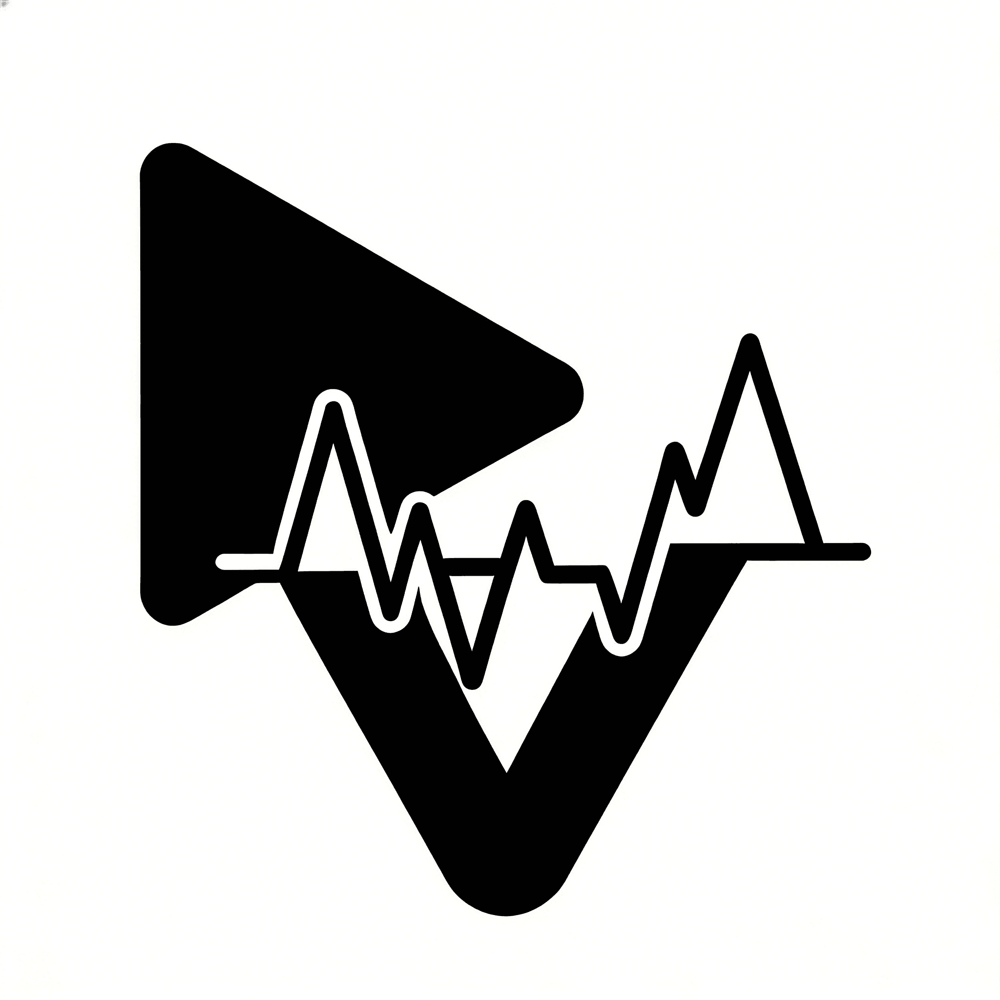

<div align="center">
  
  <h1>VidGnost</h1>
  <p><strong>面向 Electron 桌面的本地优先视频分析工作台</strong></p>
  <p>支持视频接入、转写、结构化笔记、检索问答、实时追踪与可复现导出。</p>
</div>

<div align="center">

[English](./README.md) | [中文](./README.zh-CN.md)

</div>

<div align="center">


[](./LICENSE)

</div>

## 项目简介

VidGnost 是一个以本地运行体验为核心的 Electron 视频分析工作台。当前仓库采用标准 TS 全栈单仓结构：

- `apps/desktop` 负责 React + Electron 渲染与桌面壳层
- `apps/api` 负责 Fastify API、任务编排、配置中心、事件流、自检与导出
- `packages/contracts` 负责前后端共享 schema
- 运行时数据统一写入根目录 `storage/`

当前主要支持：

- 从 Bilibili 链接、本地绝对路径或上传文件创建任务
- 使用本地 `whisper.cpp` CLI 或兼容 ASR API 完成转写
- 通过 Ollama 或 OpenAI-compatible API 生成笔记与导图
- 通过检索与问答链路回溯视频证据
- 通过 SSE 持续输出任务状态、自检结果和问答流
- 持久化任务记录、工件、事件日志与 trace，便于回放和导出

当前实现边界：

- 本地 Whisper 路径需要用户提前准备 `whisper-cli` 和 `ggml` 模型文件，当前不内置 auto-download
- Ollama 当前以配置与状态探测为主，不接管 `pull`、自动重启或自动迁移现有模型文件
- VQA 统一使用 transcript-only `vector-index` 单路线检索，按向量召回 + rerank 输出最终命中结果

## 核心能力

### 1. 端到端任务流水线

任务处理保持 `A -> B -> C -> D` 四阶段：

1. `A`：来源校验与媒体准备
2. `B`：音频提取与预处理
3. `C`：ASR 转写
4. `D`：转录修正、笔记、导图与导出工件生成

### 2. 工作台视图

- `flow`：查看任务进度、阶段日志、转写、笔记和导图产物
- `qa`：基于证据检索进行问答，支持流式回答与引用
- `debug`：查看检索链路与 trace 细节
- `diagnostics`：执行系统自检并查看问题摘要

### 3. 模型与运行时架构

| 组件 | 默认路径 | 说明 |
| --- | --- | --- |
| Whisper | 本地 `whisper.cpp` CLI / 兼容 ASR API | 本地路径需手动准备 CLI 与 `ggml` 模型 |
| LLM | Ollama 或在线 OpenAI-compatible API | 用于纠错、笔记、导图、问答 |
| Embedding | Ollama 或在线 API | 用于 transcript-only 检索向量化 |
| Rerank | Ollama 或在线 API | 用于结果重排 |

## 仓库结构

```text
VidGnost/
├─ apps/
│  ├─ api/                       # Fastify + TypeScript 后端
│  │  ├─ src/                    # 后端源码
│  │  └─ test/                   # 后端测试
│  └─ desktop/                   # Electron 桌面应用
│     ├─ electron/               # 主进程 / preload / splash
│     ├─ public/                 # 静态资源
│     └─ src/                    # 渲染层源码
│        ├─ app/                 # 应用装配与全局样式
│        ├─ components/          # UI 与业务组件
│        ├─ hooks/               # 渲染层 hooks
│        ├─ lib/                 # 客户端服务与工具
│        ├─ stores/              # Zustand 运行时 store
│        └─ workers/             # 渲染层 worker
├─ packages/
│  ├─ contracts/                 # 前后端共享 schema
│  └─ shared/                    # 共享常量
├─ docs/
├─ scripts/
├─ storage/                      # 运行时数据目录（默认本地生成）
├─ start-all.ps1
├─ start-all.sh
├─ README.md
└─ README.zh-CN.md
```

## 环境要求

- Node.js `18+`
- 已启用 Corepack
- `pnpm`
- 系统中可直接调用：
  - `ffmpeg`
  - `ffprobe`
  - `yt-dlp`
- 至少具备一种模型接入方式：
  - 本地 Ollama
  - 或在线 OpenAI-compatible API

## 快速开始

### 方式一：一键启动

Windows PowerShell：

```powershell
cd F:\in-house project\VidGnost
powershell -ExecutionPolicy Bypass -File .\start-all.ps1
```

Linux / macOS / WSL：

```bash
cd /path/to/VidGnost
./start-all.sh
```

### 方式二：手动启动开发环境

安装依赖：

```bash
pnpm install
```

启动后端：

```bash
pnpm --filter @vidgnost/api dev
```

启动前端 Web 调试模式：

```bash
pnpm --filter @vidgnost/desktop dev --host 127.0.0.1 --port 6221
```

启动 Electron 桌面开发模式：

```bash
pnpm --filter @vidgnost/desktop desktop:dev
```

默认本地地址：

- 后端 API：`http://127.0.0.1:8666/api`
- 前端 Vite：`http://127.0.0.1:6221`

## 常用校验命令

```bash
pnpm typecheck
pnpm test
pnpm build
node scripts/check-openspec.mjs
```

## 相关文档

- [English README](./README.md)
- [OpenSpec 索引](./docs/openspec/README.md)
- [当前技术栈](./docs/current-tech-stack.zh-CN.md)
- [TS 全栈重构执行清单](./docs/vidgnost-ts-fullstack-refactor-checklist.zh-CN.md)
- [前端驱动后端执行清单](./docs/frontend-driven-backend-execution-checklist.zh-CN.md)
- [Git 提交规范](./docs/git-commit-convention.md)

## License

本仓库基于 [MIT License](./LICENSE) 发布。
