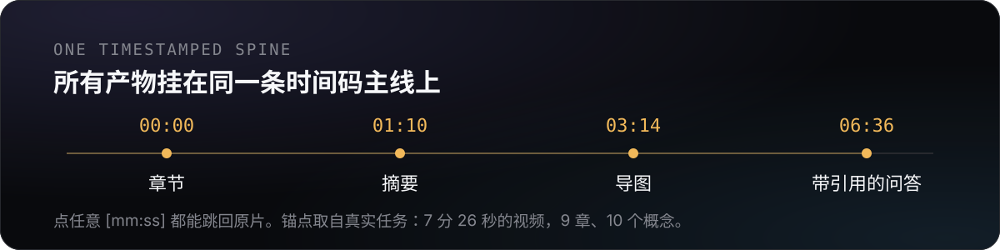

<div align="center">
  

  <h1>VidGnost</h1>

  <p><strong>视频知识引擎。</strong><br />
  把任意视频或音频压成一条带时间码的主线——章节、摘要、导图、概念与带引用的问答都挂在上面，
  每一个 <code>[mm:ss]</code> 都能点回原片。</p>

  <p><a href="./README.md">English</a> | <a href="./README.zh-CN.md">中文</a></p>

  <p>
    
    
    
    
    
    <a href="./LICENSE"></a>
  </p>
</div>

## 用起来是什么样

<p align="center">
  
</p>

<p align="center"><sub>本仓库的真实运行结果——一段 7 分 26 秒的视频，产出 9 章、10 个概念。
左栏是章节列表；中间的每条结论都带可点击的时间码；Copilot 的回答会给出引用来自哪个片段。</sub></p>

## 它和转写工具差在哪

普通转写给你一坨文字，普通摘要给你一段无法核对的结论。VidGnost 的做法是**先建立带时间戳的结构，
再让所有产物挂上去**，因此没有一条结论是死的。

<p align="center">
  
</p>

1. **每一句结论都能回到原片。** 摘要要点、原文行、导图节点、概念与问答共用同一个 `seek` 实现，
   点击时间码即跳转播放。
2. **在线优先、本地兜底。** 默认使用阿里云百炼的对话、视觉、向量、翻译与文件级 ASR；
   密钥缺失或网络不可用时回退本地 `faster-whisper`。
3. **产物即结构。** 章节是结构单元，检索块绑定章节，索引同时覆盖正文、上下文前缀与问题变体。

## 快速开始

环境要求：Node.js 18+、`pnpm`、`ffmpeg`/`ffprobe` 在 `PATH` 中。
需要下载在线视频时还要 `yt-dlp`；使用本地 Whisper 需要 Python 3.10+ 与 `uv`。

```bash
pnpm install

# 终端一：后端
pnpm dev:backend

# 终端二：Electron 桌面窗口
pnpm dev:desktop
```

只想调渲染层（不起 Electron 外壳）时：

```bash
pnpm dev:frontend        # http://127.0.0.1:6221
```

然后把本地文件拖进资产库，或粘贴一个链接。

## 处理管线

十个阶段顺序执行，每个阶段写检查点，中断后是从断点续跑而不是从头再来：

| # | 阶段 | 产出 |
| --- | --- | --- |
| 1 | `ingest` | 媒体落盘、时长与内容指纹 |
| 2 | `audio` | 16kHz 单声道音频、ASR 分片 |
| 3 | `transcribe` | 句级 + 词级时间戳转写、SRT、纯文本 |
| 4 | `structure` | 语义段落、章节（含要点与时间锚点） |
| 5 | `insight` | TL;DR、核心结论、行动项、疑问、术语表、标签 |
| 6 | `mindmap` | 导图树 + Mermaid 源码 |
| 7 | `knowledge` | 概念与关系的轻量知识图谱 |
| 8 | `vision` | 关键帧、屏上文字、多模态图注 |
| 9 | `index` | 上下文前缀、问题变体、向量与 BM25 索引 |
| 10 | `finalize` | Markdown 报告、JSON 数据包、翻译工件 |

阶段缓存键为 `sha1(阶段 | 来源指纹 | 相关模型路由 | 相关选项)`，因此**换模型只会重跑受影响的阶段**。

### 检索与问答

1. 以章节为边界切块（目标 320 token / 80 token 重叠）。
2. 为每块生成 50-80 token 的上下文前缀与 3 个问题变体（解决指代丢失与口语化提问）。
3. 向量 top-40 与 BM25 top-40 并行召回，RRF（k=60）融合。
4. OpenRouter 重排前 30 条，取 top-K（默认 8）作为证据。
5. 「整体讲了什么」这类全局问题走章节摘要 map-reduce，而不是片段 top-k。
6. 回答流式生成，服务端把 `[mm:ss]` 校验并映射成结构化引用。

## 模型与密钥

流水线只依赖角色，不依赖具体模型名：

| 角色 | 默认模型 | 提供方 |
| --- | --- | --- |
| `llm.fast` | `qwen3.8-flash` | 百炼 |
| `llm.balanced` | `qwen3.8-27b` | 百炼 |
| `llm.reasoning` | `deepseek-v4-pro-0813` | 百炼 |
| `llm.quality` | `qwen3.8-max-0902` | 百炼 |
| `llm.bulk` | `qwen3.8-2.4t-a95b` | 百炼 |
| `llm.fallback` | `deepseek-v4-flash-0731` | 百炼 |
| `vision.primary` | `qwen3.8-omni-flash` | 百炼 |
| `asr.online` | `qwen-audio-3.1-asr-flash-filetrans` | 百炼 |
| `asr.local` | `faster-whisper` | 本地 |
| `embedding` | `qwen3.7-text-embedding-flash` | 百炼 |
| `rerank` | `nvidia/llama-nemotron-rerank-vl-1b-v2:free` | OpenRouter |
| `translate` | `qwen-mt-uni` | 百炼 |

密钥从环境变量读取；「模型」工作区也支持就地填写内联密钥，界面只显示脱敏尾码：

```bash
DASHSCOPE_API_KEY=sk-xxxxxxxx      # 阿里云百炼
OPENROUTER_API_KEY=sk-or-v1-xxxx   # OpenRouter（重排序）
```

## 工作台

四个工作区，共用一套时间坐标。

<p align="center">
  
</p>

- **资产库**：所有已处理视频的唯一入口，展示就绪度、标签与规模，支持搜索与删除。
- **工作台**：章节轨 / 内容舞台 / Copilot 三栏，底部常驻播放条；笔记、原文、导图、概念、画面
  五个页签；处理中显示实时阶段看板。
- **模型**：先分「在线模型 / 本地模型」两域，域内按提供方与能力细分到具体模型；
  密钥与 Base URL 在提供方块内维护，角色直接分配在模型卡片上。
- **设置**：默认处理参数、存储目录与工具链探测。

<p align="center">
  
</p>

界面暗色优先：石墨画布 + 极光微光、发丝描边、8pt 栅格、等宽时间码、全局 `Ctrl/⌘ + K` 命令面板；
浅色主题与暗色走同一套语义令牌，并用 `node scripts/check-theme-contrast.mjs` 校验到同一对比度标准。

## 仓库结构

```text
VidGnost/
├─ apps/
│  ├─ api/                    # Fastify + TypeScript 后端
│  │  ├─ python/              # faster-whisper 隔离 Python worker
│  │  ├─ src/core/            # 配置、错误、文件、文本、进程
│  │  ├─ src/providers/       # 模型目录、角色路由、提供方客户端、健康自检
│  │  ├─ src/media/           # 来源解析、音频抽取、关键帧与感知哈希
│  │  ├─ src/asr/             # 在线/本地转写编排与标准化
│  │  ├─ src/insight/         # 分段、章节、摘要、导图、知识图谱、翻译
│  │  ├─ src/retrieval/       # 切块、BM25、向量索引、混合检索、问答
│  │  ├─ src/pipeline/        # 阶段引擎、任务管理器、事件总线
│  │  ├─ src/store/           # 任务与工件仓库
│  │  ├─ src/routes/          # HTTP 与 SSE 路由
│  │  └─ test/                # Vitest 单元测试
│  └─ desktop/                # Electron + React 桌面端
│     ├─ electron/            # 主进程、preload、启动闪屏
│     └─ src/                 # 渲染层：shell / library / studio / views
├─ packages/
│  ├─ contracts/              # 前后端共享领域契约（zod 校验请求体）
│  └─ shared/                 # 共享常量
├─ assets/readme/             # README 视觉资产（机制图与界面截图）
├─ docs/openspec/             # 变更提案、设计与能力规格
├─ storage/                   # 运行时数据（任务、工件、索引、配置）
└─ scripts/                   # 校验与运维脚本
```

## 校验

```bash
pnpm build                                            # 构建全部工作区
pnpm -r typecheck                                     # 全包类型检查
pnpm -r test                                          # 渲染层 40 项 + 后端 125 项单测
node scripts/check-openspec.mjs                       # 规格结构校验
node scripts/check-theme-contrast.mjs                 # 浅色/深色 42 组配色对比度
node scripts/check-spec-sync.mjs                      # 代码变更是否同步了规格
```

## 相关文档

- [OpenSpec 索引](./docs/openspec/README.md) —— 提案、设计与九份能力规格
- [当前技术栈](./docs/current-tech-stack.zh-CN.md)
- [提交与发版规范](./docs/git-commit-convention.md)

## License

本仓库基于 [MIT License](./LICENSE) 发布。
