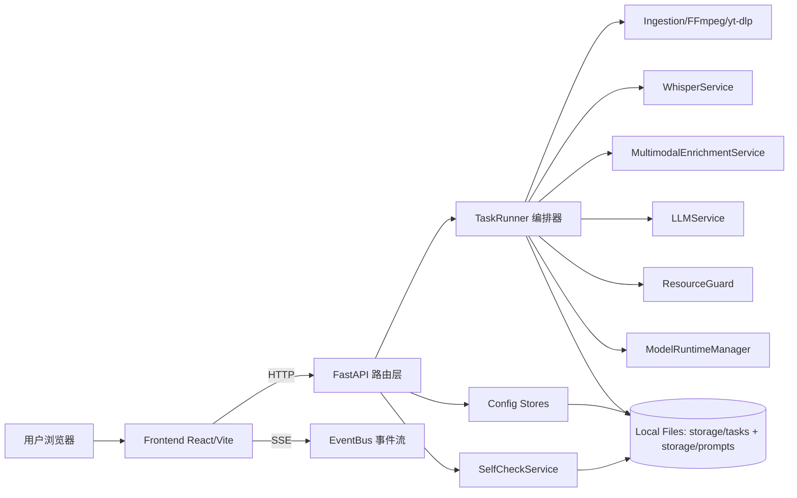

# VidGnost 架构评估与优化报告（2026-04-03）

## 1. 报告范围与评估方法

本报告基于当前 `master` 分支实际代码与文档进行评估，重点覆盖：

- 后端：`FastAPI + TaskRunner + 多模态链路 + 运行时部署 + 数据持久化`
- 前端：`React 工作台 + SSE 实时流 + 配置中心 + 快速开始文档`
- 工程与运行：`启动脚本、依赖管理、模型缓存与资源守卫`

评估方式：

1. 代码级静态审阅（核心入口、服务编排、数据模型、前端主工作台）。
2. 现有能力与目标一致性对照（质量优先、GPU-only、本地/API 双模式）。
3. 输出“真实成立的不足”与“可执行优化动作”，避免泛泛建议。

## 1.1 执行进展（2026-04-03）

> 以下为本轮“按报告直接执行优化”的落地状态（激进改造项除外）。

| 优化项 | 状态 | 本轮落地结果 |
| --- | --- | --- |
| O1 拆分后端编排器 | 已完成（阶段一） | 从 `TaskRunner` 剥离 `whisper_warmup_service.py`、`runtime_prepare_service.py`，`TaskRunner` 改为委派并清理遗留会话实现。 |
| O2 拆分前端主工作台 | 部分完成 | 已新增 `frontend/src/hooks/use-runtime-prepare.ts`、`use-task-stream.ts`、`use-task-events.ts`、`use-self-check.ts`、`use-self-check-events.ts`、`use-prompt-template-manager.ts`、`use-workbench-task-manager.ts`、`use-workbench-config-manager.ts`、`use-workbench-select-options.ts`、`use-workbench-ui-effects.ts`、`use-workbench-task-event-handler.ts`，并将自检弹窗、Source/确认弹窗、历史弹窗、提示词模板配置 Tab、工作台 Header/侧边栏/运行主面板、Whisper 配置分栏、本地模型配置分栏、配置中心弹窗编排、工作台主视图拼装抽离到 `frontend/src/components/self-check-modal.tsx`、`frontend/src/components/workbench-modals.tsx`、`frontend/src/components/history-modal.tsx`、`frontend/src/components/prompt-templates-tab.tsx`、`frontend/src/components/workbench-header.tsx`、`frontend/src/components/workbench-sidebar.tsx`、`frontend/src/components/workbench-runtime-main.tsx`、`frontend/src/components/whisper-config-tab.tsx`、`frontend/src/components/local-models-config-tab.tsx`、`frontend/src/components/workbench-config-modal.tsx`、`frontend/src/components/workbench-main-view.tsx`；App 级常量/工具已下沉到 `frontend/src/app/workbench-config.ts`；`pages/features` 全量拆分仍在后续迭代。 |
| O3 统一模型资产管理 | 已完成 | 新增 `model_asset_manager.py` 并接入部署器与多模态链路，统一 HF/OCR 下载、重试、解压与缓存判定。 |
| O4 外部 API 韧性层 | 已完成 | 新增 `llm_client_runtime.py`，在 LLM/VLM 调用侧统一重试、退避、熔断策略。 |
| O5 密钥存储安全升级 | 已完成（基础版） | 新增 `secret_store.py`（Fernet 加密），LLM/HF/VLM API key 从明文配置分离，配置接口默认掩码返回，支持 `reveal_secrets` 明文读取。 |
| O6 结构化持久化分层 | 已完成（渐进版） | 新增 `TaskStageMetricRecord` / `TaskRuntimeWarningRecord`，并在 `TaskRunner` 中落库；数据库增加版本化迁移记录表 `schema_migration_record`。 |
| O7 事件追踪增强 | 已完成 | SSE 事件自动注入 `trace_id`；新增 `storage/event-logs/<task_id>.jsonl` 结构化追踪；新增 `docs/error-codes.zh-CN.md`。 |
| O8 测试体系补齐 | 已完成（最小集） | 前端新增 `Vitest + RTL` 测试基线与 `Playwright` smoke；后端补充事件追踪与结构化 DB 表测试。 |
| O9 前端性能优化 | 部分完成 | 日志面板改为“默认折叠最近窗口 + 可展开全部”，取消运行期硬截断，保障任务生命周期内日志完整可见；同时将高频流式缓冲/刷新增量与 SSE 生命周期管理下沉到 `use-task-stream`、`use-task-events`、`use-self-check-events`；配置与任务操作逻辑下沉到 `use-workbench-config-manager`、`use-workbench-task-manager`；选项构建、任务事件分支与 UI 副作用进一步下沉到 `use-workbench-select-options`、`use-workbench-task-event-handler`、`use-workbench-ui-effects`；工作台主视图拼装下沉到 `workbench-main-view`、App 常量/工具下沉到 `workbench-config`；`App.tsx` 已从约 4900+ 行压缩至约 850 行。全量独立 store 与更细粒度渲染分区仍在后续迭代。 |

---

## 2. 当前架构总览

### 2.1 系统分层（现状）

### 2.2 后端关键结构

- API 层：`routes_tasks / routes_config / routes_self_check / routes_health`
- 编排核心：`TaskRunner` 承担
  - 任务调度
  - 四阶段流水线执行
  - SSE 事件推送
  - 运行时预热/部署会话管理
- 运行时与模型：
  - `WhisperService`（ASR）
  - `MultimodalEnrichmentService`（场景检测、抽帧、去重、OCR/VLM）
  - `LLMService`（纠错、总结、导图）
  - `ModelRuntimeManager`（GPU 串行锁 + 组件级 LRU 驱逐）
- 持久化：
  - 主表 `TaskRecord`（大量文本/json 字段）
  - 提示词模板与选择表
  - 任务产物索引与预算清理

### 2.3 前端关键结构

- 主工作台仍由单一 `App.tsx` 主容器承载（已压缩到约 850 行），部分区域已拆分为独立组件与 hooks。
- 通过 `lib/api.ts` 与后端交互，SSE 驱动实时日志/进度/流式内容。
- 配置中心已分栏：`本地模型 / Faster-Whisper / 提示词模板`。
- 运行态输出：A/B/C/D 阶段面板 + 详细笔记/导图并行流式。

---

## 3. 当前架构的优点（应保留）

1. **质量优先策略清晰**：GPU-only 与资源预检已内建，避免 CPU 低质兜底。
2. **可观测性较好**：SSE 事件包含阶段、日志、进度、warning 与耗时信息。
3. **多模态链路可控**：`dhash/phash`、场景阈值、OCR/VLM 开关参数化。
4. **运行时治理有基础**：模型预热、部署进度、取消部署、缓存状态可见。
5. **导出与持久化闭环**：`notes/mindmap` 可编辑并与导出一致，支持字幕与 bundle。

---

## 4. 真实成立的不足（按优先级）

## 4.1 高优先级

| ID | 不足点 | 影响 | 证据位置 |
|---|---|---|---|
| H1 | `TaskRunner` 职责过重（调度 + 流水线 + SSE + 预热会话 + 部署会话 + 清理） | 可维护性下降，改动风险高，回归成本高 | `backend/app/services/task_runner.py` |
| H2 | 前端 `App.tsx` 过大、状态与副作用高度耦合 | 迭代效率低，易出现回归与性能抖动 | `frontend/src/App.tsx` |
| H3 | 多模态模型下载/解压逻辑存在重复实现 | 行为不一致风险，补丁需要多点修改 | `local_runtime_deployer.py` 与 `multimodal_enrichment.py` |
| H4 | 外部 API 稳定性策略不完整（缺少统一重试/熔断/退避策略） | 云端波动时失败率高，错误体验不稳定 | `summarizer.py`、`multimodal_enrichment.py` |
| H5 | 配置与密钥以明文落盘（`model_config.json`） | 安全边界较弱，尤其是共享机器/远程环境 | `backend/storage/model_config.json`（运行时文件） |

## 4.2 中优先级

| ID | 不足点 | 影响 | 证据位置 |
|---|---|---|---|
| M1 | `TaskRecord` 大量 JSON/Text 字段，结构化查询能力弱 | 后续做统计、检索、审计时效率受限 | `backend/app/models.py` |
| M2 | 文件持久化结构缺少显式版本/迁移机制 | 演进可控性不足，复杂变更风险高 | `backend/app/services/task_store.py` |
| M3 | EventBus 为进程内内存实现，重启后流历史丢失 | 可观测数据不可追溯，跨进程扩展困难 | `backend/app/services/events.py` |
| M4 | 前端测试缺口明显（缺少组件级与 E2E 自动化） | UI 回归依赖手工验证，发布风险上升 | `frontend` 当前无系统化测试目录 |
| M5 | 错误码虽已统一响应，但缺少集中“错误码字典”文档 | 前后端联调和排障成本偏高 | `backend/app/errors.py`、`backend/app/api/error_handlers.py` |

## 4.3 低优先级

| ID | 不足点 | 影响 | 证据位置 |
|---|---|---|---|
| L1 | 启动脚本职责较多（安装、修复、端口占用清理、启动） | 脚本维护复杂，异常场景定位成本偏高 | `scripts/bootstrap-and-run.sh/.ps1` |
| L2 | 资源阈值多处硬编码，配置集中度一般 | 针对不同机器做策略调优不够灵活 | `resource_guard.py`、`multimodal_enrichment.py` |

---

## 5. 优化方案（可执行版本）

下述动作遵循：**质量 > 稳定性 > 性能 > 复杂度**。

## 5.1 架构重构（优先）

### O1. 拆分后端编排器（对应 H1）

目标：将 `TaskRunner` 从“全能类”重构为“编排 + 阶段执行器”。

建议拆分：

- `pipeline_orchestrator.py`：只负责任务生命周期与阶段切换
- `stage_a_ingestion.py`：输入准备与预检
- `stage_b_audio.py`：音频提取与分块
- `stage_c_asr.py`：ASR 流式转写
- `stage_d_fusion.py`：纠错、多模态融合与生成
- `runtime_prepare_service.py`：本地模型部署会话（从 `TaskRunner` 剥离）
- `whisper_warmup_service.py`：Whisper 预热会话（从 `TaskRunner` 剥离）

预期收益：

- 变更影响面缩小，单测更细粒度。
- 阶段逻辑可独立压测与优化。

### O2. 拆分前端主工作台（对应 H2）

目标：将 `App.tsx` 拆为页面容器 + 领域组件 + hooks。

建议拆分：

- `pages/workbench-page.tsx`
- `pages/quick-start-page.tsx`
- `features/runtime/`（SSE、阶段面板、日志、Working 动画）
- `features/config-center/`（本地模型/Whisper/提示词）
- `features/history/`
- `hooks/use-task-stream.ts`
- `hooks/use-runtime-prepare.ts`

预期收益：

- 状态边界更清晰，减少跨区域副作用耦合。
- 新需求接入时无需触碰超大文件。

### O3. 统一模型资产管理器（对应 H3）

目标：合并 `LocalRuntimeDeployer` 与 `MultimodalEnrichmentService` 中重复的下载/解压/缓存判断逻辑。

建议新增：

- `model_asset_manager.py`
  - `ensure_hf_snapshot(...)`
  - `ensure_ocr_bundle(...)`
  - `safe_extract_tar(...)`
  - `cleanup_partial_assets(...)`

预期收益：

- 下载与解压行为一致。
- 失败恢复逻辑统一（尤其终止部署时的清理一致性）。

---

## 5.2 可靠性与安全性增强

### O4. 外部 API 韧性层（对应 H4）

改造要点：

1. 为 LLM/VLM API 调用封装统一 `retry + exponential backoff + jitter`。
2. 区分可重试错误（超时、429、5xx）与不可重试错误（4xx 参数错误）。
3. 增加短时熔断窗口，避免连续失败拖垮任务时长。

建议落点：

- `backend/app/services/llm_client_runtime.py`（新）
- `summarizer.py` 与 `multimodal_enrichment.py` 改为调用统一客户端层

### O5. 密钥存储安全升级（对应 H5）

建议：

1. 本地模式保留 JSON 配置，但 API Key/HF Token 改存系统密钥服务（首选）或加密存储。
2. 后端响应默认返回掩码值，前端按需“显示明文”时再单独请求。
3. 增加“导入/清空密钥”操作审计日志。

---

## 5.3 数据层与可观测性改进

### O6. 持久化结构分层（对应 M1, M2）

建议：

1. 保留 `TaskRecord` 主表用于主查询。
2. 新增扩展表（渐进式，不破坏现有 API）：
   - `task_stage_metric_record`
   - `task_runtime_warning_record`
   - `task_segment_evidence_record`（可选，按容量开关）
3. 引入版本化迁移工具（如 Alembic），逐步替代手工 `ALTER TABLE`。

### O7. 事件追踪增强（对应 M3, M5）

建议：

1. 统一事件/错误码字典文档（新增 `docs/error-codes.zh-CN.md`）。
2. SSE 事件增加 `trace_id`（与后端日志一致）。
3. 按任务输出结构化日志（JSON lines），用于离线排障。

---

## 5.4 前端质量保障与性能优化

### O8. 补齐测试体系（对应 M4）

建议最小集：

1. `Vitest + React Testing Library`：关键组件交互。
2. `Playwright`：上传任务、配置保存、SSE 展示、导出验证。
3. API 合约快照：保证错误结构 `{code,message,detail}` 不回归。

### O9. 渲染与状态性能（对应 H2 延伸）

建议：

1. 将高频 SSE 更新状态从页面级 state 下沉到专用 store（如 Zustand）。
2. 对日志面板引入虚拟滚动（当前 transcript 已优化，日志仍可继续优化）。
3. 重计算逻辑（标题解析、文档目录计算）使用 memo 与分块更新。

---

## 6. 建议实施顺序（不牺牲质量）

1. **第一批（高收益低风险）**：O3、O4、O8、O9  
2. **第二批（架构降复杂）**：O1、O2  
3. **第三批（中长期治理）**：O5、O6、O7

---

## 7. 量化验收指标（建议）

| 维度 | 指标 | 目标 |
|---|---|---|
| 稳定性 | 连续 20 个任务失败率（排除输入损坏） | < 2% |
| 稳定性 | API 波动场景任务成功率（重试后） | >= 95% |
| 资源 | 8G 显存场景 OOM 次数 | 0（标准用例集） |
| 性能 | 60 分钟视频端到端耗时波动 | P95/P50 <= 1.5 |
| 质量 | 笔记结构完整率（章节/要点/时间锚点） | >= 95% |
| 工程 | 前端关键路径 E2E 用例通过率 | 100% |
| 工程 | 变更回归缺陷密度 | 持续下降（每迭代统计） |

---

## 8. 结论

VidGnost 当前已经具备“可交付原型 + 可持续演进”的基础，尤其在 GPU-only、SSE 可观测、多模态可配置方面方向正确。  
当前真正的主要短板不在算法能力本身，而在**复杂度治理与工程韧性**：

- 后端编排器与前端主页面过于集中；
- 模型资产逻辑存在重复实现；
- 外部 API 韧性与安全存储还需加强；
- 数据结构化与测试体系需要补齐。

如果按本报告顺序推进，能够在不牺牲分析质量前提下，显著提升维护效率、稳定性与可扩展性。
