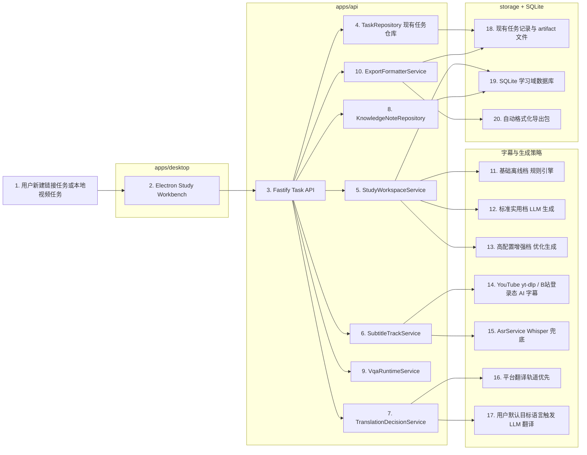
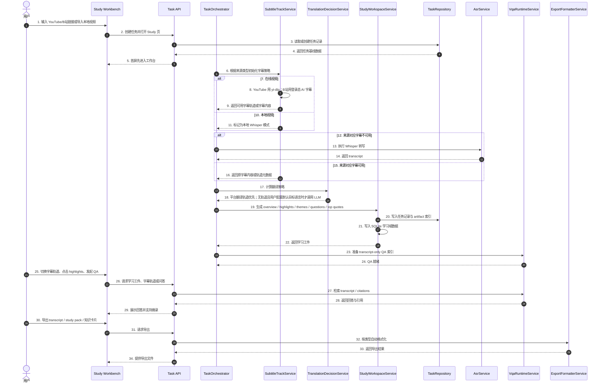

# VidGnost 学习工作台改造执行方案

更新时间：2026-04-20

状态：planned

## 1. 文档目的

这份文档直接服务于 VidGnost 仓库后续改造，不再使用 LongCut 仓库作为叙述主体。

目标是把 VidGnost 从当前的“本地分析与 VQA 工作台”，升级为：

- 本地优先；
- 支持在线视频与本地视频双通路；
- 支持来源区分的在线字幕与本地兜底转写；
- 支持可选翻译；
- 支持知识沉淀与自动格式化导出；
- 同时保留任务控制、SSE、诊断、自检和本地模型配置优势的学习工作台。

## 2. 改造目标

### 2.1 总目标

VidGnost 后续要整合的不是几个零散功能，而是一整套学习工作台能力：

- Study 首屏；
- 学习速览；
- highlights；
- themes；
- 推荐问题；
- transcript-grounded QA；
- 字幕轨道切换；
- 可选翻译；
- 知识卡片；
- 学习资料库；
- 自动格式化导出。

### 2.2 保留边界

这次改造必须同时保留三条边界：

- 不迁移 SaaS 基建；
- 不照搬不适合本地离线的交互节奏；
- 不继续扩大 VLM / 抽帧 / 图像语义检索链路。

### 2.3 现实前提

VidGnost 不是统一算力平台，而是用户本地配置驱动。

所以所有新能力都必须支持：

- 按能力分层；
- 可降级；
- 可后台补全；
- 可缓存复用；
- 可导出。

## 3. 新的能力分层

### 3.1 基础离线档

适用现实：

- CPU；
- Whisper 可用；
- 没有本地 LLM；
- 没有远程 API。

这一档必须具备：

- YouTube 字幕优先使用 `yt-dlp` 列出的平台轨道；
- B 站字幕优先使用登录态 AI 字幕；
- 来源对应字幕不可用时退回 Whisper；
- 本地视频直接 Whisper；
- 启发式 overview；
- 启发式 highlights；
- 启发式 themes；
- Play All；
- transcript 阅读与摘录；
- 学习状态记录；
- 学习资料库最小版。

这一档默认不要求：

- 高质量 LLM 主题组织；
- 默认翻译层；
- 高级问题推荐。

### 3.2 标准实用档

适用现实：

- Whisper 可用；
- 配置了本地 LLM 或远程 OpenAI-compatible LLM；
- 用户希望获得完整学习体验。

这一档应具备：

- 高质量 overview；
- 结构化 highlights；
- themes；
- 推荐问题；
- transcript-grounded QA；
- 知识卡片；
- 学习资料库；
- 在线字幕轨道实时切换；
- 平台翻译轨道优先；
- 无平台翻译轨道且用户配置默认目标语言时触发 LLM 翻译。

### 3.3 高配置增强档

适用现实：

- GPU 可用；
- 本地或远程 LLM 配置完整；
- `yt-dlp`、B 站登录态 AI 字幕、Whisper、导出链路稳定。

这一档进一步增强：

- 更稳定的长 transcript 切块与引用整理；
- 更高质量 highlights / themes / questions；
- 更稳定的字幕轨道缓存；
- 更稳定的翻译缓存与导出；
- 更强的跨任务知识关联。

## 4. 目标形态

### 4.1 目标产品心智

改造后的 VidGnost 应让用户形成这样的理解：

- 我可以直接贴 YouTube / B 站链接进入学习工作台；
- 也可以继续导入本地视频；
- 系统优先帮我拿到可用字幕；
- 如果平台没字幕，系统会自动转写；
- 我能先看重点，再决定是否深入问答；
- 重要内容能沉淀成我自己的知识卡片；
- 下次回来能从上次状态继续。

### 4.2 目标工作台层级

建议把当前工作台结构升级为：

- `Study`
- `QA`
- `Flow`
- `Trace`

其中：

- `Study` 成为默认入口；
- `QA` 承接问题探索；
- `Flow` 保留任务执行过程；
- `Trace` 保留诊断与深挖能力。

## 5. 目标架构与 Mermaid

### 5.1 目标架构图

### 5.2 目标处理时序图

## 6. 数据层改造方案

### 6.1 总原则

VidGnost 后续学习域数据应采用：

- SQLite 主存储；
- 现有 `storage/` 文件系统继续承担大文本、导出物、日志和任务 artifact；
- JSON 不再作为学习域核心业务主库。

### 6.2 建议新增的学习域实体

建议在 SQLite 中至少建立以下表或等价实体：

| 表名 | 用途 |
| --- | --- |
| `study_tasks` | 学习域任务主表，映射现有 task id、来源类型、标题、语言、时长 |
| `study_packs` | overview、generation tier、fallback 状态、生成时间 |
| `study_highlights` | 重点片段、时间段、排序、播放序列 |
| `study_themes` | 主题标题、摘要、排序 |
| `study_questions` | 推荐问题、排序、主题关联 |
| `study_quotes` | 代表性引用、时间段、主题关联 |
| `study_state` | 上次位置、选中主题、active highlight、favorite、last opened |
| `subtitle_tracks` | 平台字幕轨道、自动翻译轨道、Whisper 轨道、可用状态 |
| `translation_records` | 翻译来源、目标语言、缓存状态、artifact 索引 |
| `knowledge_notes` | 用户摘录卡片、备注、来源类型、任务关联 |
| `export_records` | 导出类型、格式、路径、时间、来源任务 |

### 6.3 文件系统继续承担的内容

`storage/` 仍然继续承载：

- 现有任务记录与历史 artifact；
- transcript 导出底稿；
- 日志与 trace；
- 导出后的 `md` / `txt` / `srt` / `vtt` / `csv` / `json` / `zip`；
- 与现有任务系统兼容的阶段产物。

### 6.4 导出策略

建议从第一版开始就明确：

| 导出内容 | 默认导出格式 | 补充格式 |
| --- | --- | --- |
| transcript | `txt` / `srt` / `vtt` | `md` |
| overview / summary | `md` | `txt` |
| highlights / themes / questions | `md` | `csv` / `json` |
| knowledge notes | `md` | `csv` / `json` |
| subtitle tracks | `json` | `csv` |
| translation records | `csv` | `json` |
| study pack | `zip` / 目录包 | `json` 元数据 |

## 7. 后端改造方案

### 7.1 要保留并重用的现有模块

可以继续复用的现有后端模块包括：

- `apps/api/src/modules/tasks/task-orchestrator.ts`
- `apps/api/src/modules/tasks/task-repository.ts`
- `apps/api/src/modules/asr/asr-service.ts`
- `apps/api/src/modules/summary/summary-service.ts`
- `apps/api/src/modules/summary/transcript-correction-service.ts`
- `apps/api/src/modules/vqa/vqa-runtime-service.ts`
- `apps/api/src/routes/tasks.ts`
- `apps/api/src/routes/task-events.ts`
- `apps/api/src/routes/task-exports.ts`
- `apps/api/src/routes/vqa.ts`

### 7.2 建议新增模块

建议新增：

- `apps/api/src/modules/study/subtitle-track-service.ts`
- `apps/api/src/modules/study/subtitle-track-types.ts`
- `apps/api/src/modules/study/translation-decision-service.ts`
- `apps/api/src/modules/study/study-workspace-service.ts`
- `apps/api/src/modules/study/study-workspace-types.ts`
- `apps/api/src/modules/study/knowledge-note-repository.ts`
- `apps/api/src/modules/study/export-formatter-service.ts`
- `apps/api/src/modules/study/sqlite-study-repository.ts`

### 7.3 `SubtitleTrackService`

职责：

- 识别来源类型是 `youtube` / `bilibili` / `local_file`；
- 对 YouTube 链接调用 `yt-dlp` 列出平台原字幕轨道；
- 对 B 站链接优先读取登录态 AI 字幕；
- 列出平台自动翻译字幕轨道；
- 对来源对应字幕不可用的在线视频自动触发 Whisper fallback；
- 对本地视频直接走 Whisper；
- 把轨道和字幕层状态写入 SQLite。

### 7.4 `TranslationDecisionService`

职责：

- 判断平台是否已有可切换的翻译字幕轨道；
- 判断用户是否配置了默认目标语言；
- 判断是否需要调用本地/在线 LLM 翻译；
- 输出翻译来源：
  - `platform_track`
  - `llm_generated`
  - `disabled`
- 翻译失败不阻塞主流程。

### 7.5 `StudyWorkspaceService`

职责：

- 基于 transcript 与现有 summary 能力生成：
  - overview
  - highlights
  - themes
  - suggested questions
  - top quotes
  - play all sequence
- 把学习工件写入 SQLite；
- 同时把需要导出的底稿写入现有 `storage/tasks/stage-artifacts/`。

### 7.6 `TaskOrchestrator` 改造方向

当前 `task-orchestrator.ts` 里仍包含：

- `multimodal_prewarm`
- `frame_extract`
- `frame_semantic`
- `multimodal_index_fusion`

后续应该改造成：

1. `transcript_optimize`
2. `subtitle_resolve`
3. `translation_resolve`
4. `study_pack_generate`
5. `notes_mindmap_generate`
6. `vqa_prewarm`

其中：

- `vqa_prewarm` 只保留 transcript-only 检索准备；
- 不再继续生成抽帧和 frame semantic。

### 7.7 `TaskRepository` 改造方向

当前 `task-repository.ts` 主要维护 JSON 记录与 artifact 文件。

后续建议：

- 继续保留现有任务记录与 artifact 逻辑；
- 新增学习域映射字段；
- 用 SQLite 补齐高频结构化数据；
- 列表页和 Study 页优先从 SQLite 读取学习预览；
- 原 JSON 任务记录继续作为兼容层和现有 API 基座。

### 7.8 路由层建议

在现有路由基础上，建议新增：

- `GET /api/tasks/:taskId/study-pack`
- `GET /api/tasks/:taskId/study-preview`
- `PATCH /api/tasks/:taskId/study-state`
- `GET /api/tasks/:taskId/subtitle-tracks`
- `POST /api/tasks/:taskId/subtitle-switch`
- `GET /api/knowledge/notes`
- `POST /api/knowledge/notes`
- `PATCH /api/knowledge/notes/:noteId`
- `DELETE /api/knowledge/notes/:noteId`
- `POST /api/tasks/:taskId/exports`
- `GET /api/tasks/:taskId/exports`

## 8. 前端改造方案

### 8.1 当前前端切入点

当前最主要的前端切入点是：

- `apps/desktop/src/components/views/task-processing-workbench.tsx`
- `apps/desktop/src/components/views/task-processing-view.tsx`
- `apps/desktop/src/components/views/history-view.tsx`
- `apps/desktop/src/components/views/new-task-view.tsx`

### 8.2 工作台重构方向

建议把 `task-processing-workbench.tsx` 拆成更清晰的学习子树：

- `study-workbench.tsx`
- `study-player-shell.tsx`
- `study-subtitle-switcher.tsx`
- `study-overview-panel.tsx`
- `study-highlights-panel.tsx`
- `study-themes-panel.tsx`
- `study-questions-panel.tsx`
- `study-transcript-panel.tsx`
- `study-note-capture.tsx`
- `knowledge-view.tsx`

### 8.3 布局策略

建议布局采用：

- 左侧：
  - themes
  - highlights
  - Play All
  - 字幕轨道列表
  - 学习目录筛选
- 中间：
  - 在线 iframe 或本地播放器
  - 当前 highlight
  - transcript 联动
- 右侧：
  - overview
  - questions
  - top quotes
  - note capture

### 8.4 在线与本地视频双通路

前端必须明确区分：

- 在线 YouTube / B 站任务：
  - 直接 iframe 播放；
  - 不默认下载到本地；
  - 可在播放器旁实时切换平台字幕轨道和自动翻译轨道。
- 本地视频任务：
  - 继续走当前本地播放器；
  - 只展示本地 transcript 与可选翻译层。

### 8.5 History 改造方向

`history-view.tsx` 应从“任务列表”升级为“学习资料库”。

建议增加：

- 最近学习时间；
- 上次播放位置；
- favorite；
- study pack 就绪状态；
- highlights 数量；
- questions 数量；
- knowledge note 数量；
- 最近导出时间。

### 8.6 Knowledge 视图

新增独立 `Knowledge` 入口，承接：

- transcript 摘录；
- QA 回答摘录；
- summary / highlight 摘录；
- 按任务、主题、来源类型筛选；
- 一键导出。

## 9. 契约层改造方案

### 9.1 建议新增契约文件

建议新增：

- `packages/contracts/src/study.ts`
- `packages/contracts/src/knowledge.ts`

并扩展：

- `packages/contracts/src/tasks.ts`

### 9.2 建议新增类型

- `StudyPackResponse`
- `StudyPreview`
- `StudyHighlight`
- `StudyTheme`
- `StudyQuestion`
- `StudyState`
- `SubtitleTrack`
- `TranslationRecord`
- `KnowledgeNote`

## 10. 执行路线

### Phase 0：统一契约与边界

目标：

- 在 contracts、OpenSpec 和根目录文档层把目标能力说清楚。

关键动作：

- 新增 `study.ts`
- 新增 `knowledge.ts`
- 扩展 `tasks.ts`
- 同步 OpenSpec 中 `video-ingestion`、`transcription-pipeline`、`history-and-export`、`web-workbench-ui`

### Phase 1：先切断重型多模态链路

目标：

- 把学习工作台主链路收口回文本字幕与 transcript。

关键动作：

- 规划废弃 `video-frame-service.ts`
- 规划废弃 `vlm-runtime-service.ts`
- 从 `task-orchestrator.ts` 中移除 `frame_extract / frame_semantic / multimodal_index_fusion`
- 把 `vqa-prewarm` 收口为 transcript-only

### Phase 2：接入在线视频字幕轨道层

目标：

- 打通 YouTube `yt-dlp` 字幕、B 站登录态 AI 字幕与 Whisper fallback。

关键动作：

- 实现 `SubtitleTrackService`
- 支持 `youtube` / `bilibili` / `local_file`
- 新增字幕轨道接口
- 记录字幕轨道和来源元数据

### Phase 3：接入翻译决策层和学习工件骨架

目标：

- 打通平台翻译轨道优先、用户配置触发 LLM 翻译的逻辑。

关键动作：

- 实现 `TranslationDecisionService`
- 实现 `StudyWorkspaceService`
- 生成 overview / highlights / themes / questions / top quotes
- 写入 SQLite 学习域

### Phase 4：Study Mode 首次上线

目标：

- 让任务详情默认先进入学习工作台。

关键动作：

- 重构 `task-processing-workbench.tsx`
- 接入 iframe 与本地播放器双通路
- 接入字幕轨道切换
- 接入 Study 左中右三栏布局

### Phase 5：知识沉淀与 History 升级

目标：

- 让用户开始积累自己的长期资产。

关键动作：

- 新增 Knowledge 视图
- 实现 KnowledgeNoteRepository
- 升级 `history-view.tsx`
- 增加 continue learning 状态

### Phase 6：导出与能力分层补齐

目标：

- 把学习结果真正变成长期可归档资产。

关键动作：

- 实现 `ExportFormatterService`
- 导出 subtitle tracks / translation records / study pack
- UI 标识当前 generation tier
- 完善基础档与标准档 fallback

## 11. 风险与控制

### 11.1 风险：现有代码还存在多模态迁移债务

控制方式：

- 优先停止继续扩展多模态链路；
- 先把 transcript-only 主链路做稳；
- 让文档、OpenSpec 和代码同时收口。

### 11.2 风险：当前任务持久化仍以 JSON 为主

控制方式：

- 学习域新增 SQLite；
- 现有 JSON 记录先保留兼容；
- 不一次性推翻当前任务系统。

### 11.3 风险：前端工作台文件继续膨胀

控制方式：

- 先拆 `task-processing-workbench.tsx`；
- 把 Study 子树独立；
- Runtime store 和学习状态分离。

### 11.4 风险：翻译行为不可预测

控制方式：

- 平台轨道优先；
- 默认不翻译；
- 只有用户显式配置默认目标语言时才做 LLM 翻译；
- 所有翻译状态可见、可导出。

## 12. 验收标准

### 12.1 功能验收

在标准实用档位下，VidGnost 至少应具备：

- Study 首屏；
- overview；
- highlights；
- themes；
- questions；
- transcript-only QA；
- 字幕轨道切换；
- 可选翻译；
- Knowledge 视图；
- 学习资料库；
- 自动格式化导出。

### 12.2 路径验收

- 在线 YouTube / B 站任务使用 iframe 播放；
- YouTube 有平台字幕时优先使用平台字幕；
- B 站有登录态 AI 字幕时优先使用 AI 字幕；
- 来源对应字幕不可用时自动退回 Whisper；
- 平台无翻译轨道时默认不翻译；
- 只有用户配置默认目标语言时才触发 LLM 翻译；
- 本地视频走 Whisper + 可选翻译。

### 12.3 边界验收

- 不重新引入 VLM；
- 不重新引入视频抽帧；
- 不重新引入图像语义检索；
- 不破坏现有 Flow / Trace / Diagnostics；
- 不破坏现有任务控制、导出、SSE 和配置中心。

## 13. 最终结论

VidGnost 后续改造的正确方向不是继续做重型多模态堆叠，而是：

- 用现有 Electron + Fastify + contracts + storage 底座；
- 承接更强的学习工作台体验；
- 让在线视频与本地视频都能自然进入同一套 Study-first 结构；
- 用 `YouTube yt-dlp 字幕 / B 站登录态 AI 字幕优先 + Whisper 兜底 + 可选 LLM 翻译 + SQLite 学习域 + transcript-only QA` 构成新的主链路；
- 明确停止在 VLM、抽帧和图像语义检索上继续扩张。

这条路线最符合当前 VidGnost 的本地离线初心，也最符合真实用户观看 YouTube / B 站时的高频痛点。
